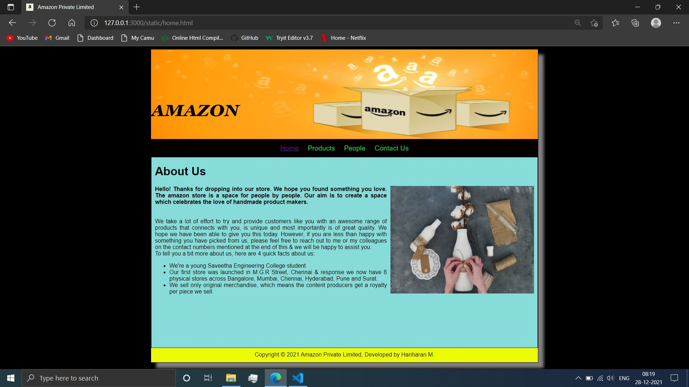
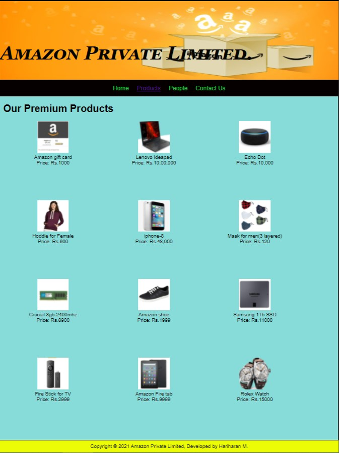
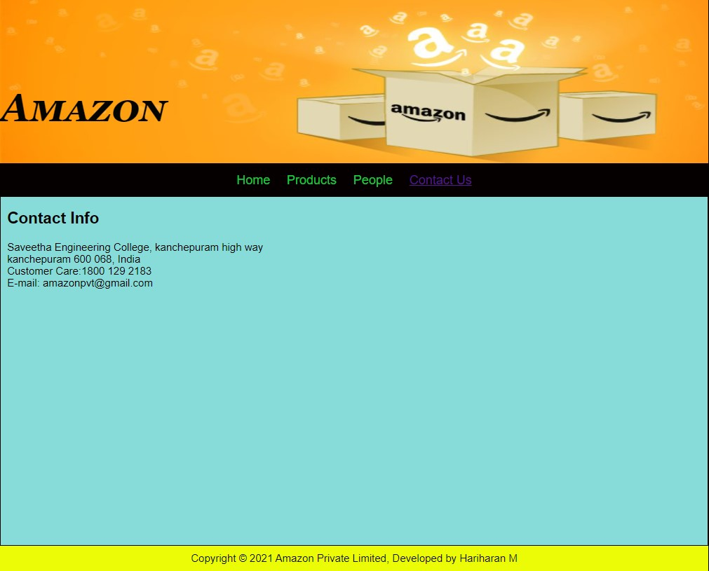

# Web Design for a Software Product Company

## AIM:

To design a static website for a software product company company.

## DESIGN STEPS:

### Step 1:

Requirement collection.

### Step 2:

Creating the layout using HTML and CSS.

### Step 3:

Updating the sample content.

### Step 4:

Choose the appropriate style and color scheme.

### Step 5:

Validate the layout in various browsers.

### Step 6:

Validate the HTML code.

### Step 6:

Publish the website in the given URL.

## PROGRAM :

### Home Page code:
~~~
<!DOCTYPE html>
<html lang="en">
  <head>
    <title>Amazon Private Limited</title>
    <link rel="stylesheet" href="./css/layout.css" />
    <link rel="icon" href="./img/images.png" type="image/x-icon" />
  </head>

  <body>
    

      
amazon

      

        
<a href="/static/home.html">Home</a>

        
<a href="/static/products.html">Products</a>

        
<a href="/static/people.html">People</a>

        
<a href="/static/contactus.html">Contact Us</a>

      

      

        

          <h1>About Us</h1>
          
          

            <b>Hello! Thanks for dropping into our store.
              We hope you found something you love. The amazon store is a space for people
              by people.
              Our aim is to create a space which celebrates the love of handmade product makers.
            </b>
                 
              We take a lot of effort to try and provide customers like you with an awesome
              range of products that connects with you, is unique and most importantly is of great
              quality.
              We hope we have been able to give you this today. However, if you are less
              than happy with something you have picked from us, please feel free to reach out to me or
              my colleagues on the contact numbers mentioned at the end of this & we will be happy to
              assist you.
               
              To tell you a bit more about us, here are 4 quick facts about us:
              <ul>
                <li>We're a young Saveetha Engineering College student</li>
                <li>Our first store was launched in M.G.R Street, Chennai & response we now
                have 8 physical stores across Bangalore, Mumbai, Chennai, Hyderabad, Pune and Surat.</li>
                <li>We sell only original merchandise, which means the content producers
                get a royalty per piece we sell.</li>
              </ul>
          

        

      

      

        Copyright &#169; 2021 Amazon Private Limited, Developed by Hariharan M.
      

    

  </body>
</html>

~~~
### Product Page code:
~~~
<!DOCTYPE html>
<html lang="en">
  <head>
    <title>Amazon Private Limited</title>
    <link rel="stylesheet" href="./css/layout.css" />
    <link rel="icon" href="./img/icon.png" type="image/x-icon" />
  </head>

  <body>
    

      
Amazon Private Limited.

      

        
<a href="/static/home.html">Home</a>

        

          <a href="/static/products.html">Products</a>
        

        
<a>People</a>

        
<a>Contact Us</a>

      

      

        
    
          <h1>Our Premium Products</h1>
          

              
 
                  

                  
                  

                  
Amazon gift card

                  
Price: Rs.1000 

              

              
 
                  

                  
                  

                  
Lenovo Ideapad

                  
Price: Rs.10,00,000 

              

              
 
                

                
                

                
Echo Dot

                
Price: Rs.10,000 

              

              
 
                

                
                

                
Hoddie for Female

                
Price: Rs.900 

              

              
 
                

                
                

                
iphone-8

                
Price: Rs.48,000

              

              
 
                

                
                

                
Mask for men(3 layered)

                
Price: Rs.120 

              

              
 
                

                
                

                
Crucial 8gb-2400mhz

                
Price: Rs.8900 

              

              
 
                

                
                

                
Amazon shoe

                
Price: Rs.1999 

              

              
 
                

                
                

                
Samsung 1Tb SSD

                
Price: Rs.11000 

              

              
 
                

                
                

                
Fire Stick for TV

                
Price: Rs.2999 

              

              
 
                

                
                

                
Amazon Fire tab

                
Price: Rs.9999 

              

              
 
                

                
                

                
Rolex Watch

                
Price: Rs.15000 

              

              
          

          
        
      

      

        Copyright &#169; 2021 EduSoft Private Limited, Developed by Obed Otto.
      

    

  </body>
</html>

~~~
### People Page code:
~~~
<!DOCTYPE html>
<html lang="en">
<head>
<title>Avengers Private Limited</title>
<link rel="stylesheet" href="./css/layout.css" />
<link rel="icon" href="./img/icon.png" type="image/x-icon" />
</head>
<body>

Avengers

<a href="/static/home.html">Home</a>

<a href="/static/products.html">Products</a>

<a href="/static/people.html">People</a>

<a href="/static/contact.html">Contact Us</a>

<h1>Our Leadership</h1>

Andrew Garfield

<b>Chairman</b>

Emma Stone

<b>Chief Executive Officer</b>

Zendaya

<b>Managing Director</b>

Tom Holland

<b>Chief Operating Officer</b>

Gal Gadot

<b>Executive Director</b>

Tobby

<b>Director</b>

Copyright &#169; 2021 Amazon Private Limited, Developed by Harihran M

</body>
</html>
~~~
### Contact Page code:
~~~
<!DOCTYPE html>
<html lang="en">
<head>
<title>Amazon Private Limited</title>
<link rel="stylesheet" href="./css/layout.css" />
<link rel="icon" href="./img/images.png" type="image/x-icon" />
</head>
<body>

Amazon

<a href="/static/home.html">Home</a>

<a href="/static/products.html">Products</a>

<a href="/static/people.html">People</a>

<a href="/static/contactus.html">Contact Us</a>

<h2>Contact Info</h2>

Saveetha Engineering College,
kanchepuram high way 
kanchepuram 600 068, India 
Customer Care:1800 129 2183 
E-mail: amazonpvt@gmail.com

Copyright &#169; 2021 Amazon Private Limited, Developed by Hariharan M

</body>
</html>
~~~

## OUTPUT:

### Home Page:

### Product Page:

### People Page:

### Contact Page:

## Result:

Thus a website is designed for the software product company and the HTML,CSS code are validated.
